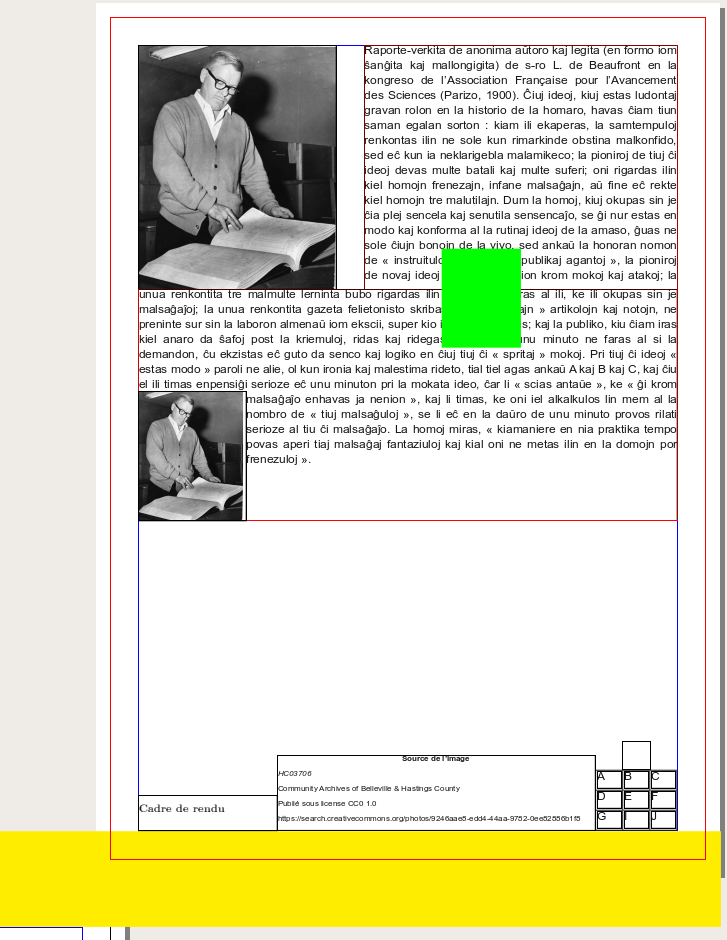
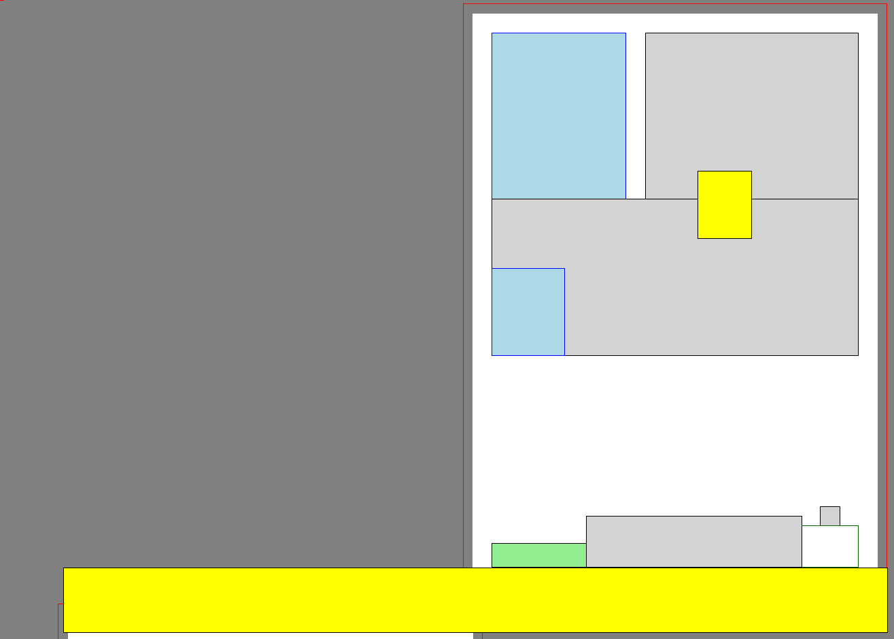

Draw a wireframe of a file
--------------------------

  ::

   import pyscribus.sla as sla
   import pyscribus.extra.wireframe as wire

   slafile = sla.SLA("wireframe.sla", "1.5.5")

   wireframe = wire.Wireframe()
   wireframe.from_sla(slafile)

   wireframe.draw(
       output="wireframe.png",
       stylesheet=True,
       margins=[10, 10]
   )

   Original SLA file. Cropped on the left side.

   Wireframe
